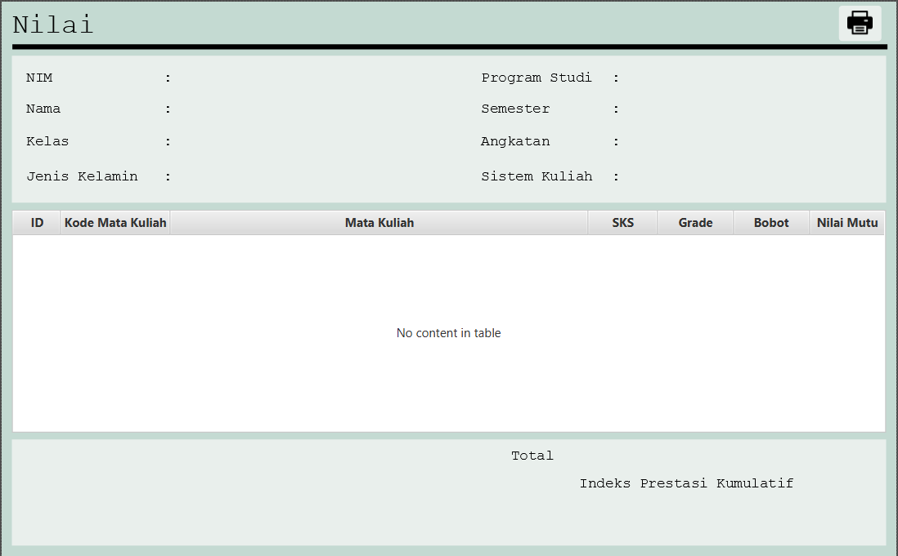

# Final-Proyek_PBO1_TIFK23A_Kelompok-5

<ul>
  <li>Mata Kuliah: Pemrograman Berorientasi Obyek 1</li>
  <li>Dosen Pengampu: <a href="https://github.com/Muhammad-Ikhwan-Fathulloh">Muhammad Ikhwan Fathulloh</a></li>
</ul>

## Kelompok
<ul>
  <li>Kelompok: {Kelompok 5}</li>
  <li>Proyek: {Sistem Akademik - KHS}</li>
  <li>Anggota:</li>
  <ul>
    <li>Ketua: <a href="">Yeremia Adrianto</a></li>
    <li>Anggota 1: <a href="">Ikmal Khoeruddin</a></li>
    <li>Anggota 2: <a href="">Perdi Ruhiyat</a></li>
  </ul>
</ul>

## Judul Studi Kasus

Sistem Akademik - KHS

## Penjelasan Studi Kasus

Pada Sistem Akademik - KHS ini memiliki 2 Role yaitu Admin dan juga Mahasiswa, yang dimana Admin dapat mengelola data mahasiswa, nilai dan juga mengelola user, sedangkan mahasiswa dapat melihat data / informasi nilai mahasiswa tersebut. 

## Penjelasan 4 Pilar OOP dalam Studi Kasus

### 1. Inheritance
- Inheritance atau Pewarisan digunakan agar class lain bisa menggunakan kembali properti dan metode dari Class induk (`Operations`).
- Class yang mewarisi dari class `Operations` adalah pada class `Mahasiswa`, `Khs`, `User`.

### 2. Encapsulation
- Encapsulation disini digunakan untuk melindungi data dengan mendeklarasikan atribut sebagai `private` dan menyediakan **getter & setter** agar data tetap aman dan terlindungi dan Encapsulation ini digunakan pada class `Mahasiswa`, `Khs`, `User`.

### 3. Polymorphism
- Metode `tambah()`, `update()`, `hapus()`, dan `showTable()` di Override id setiap subclass (`Mahasiswa`, `Khs`, dan `User`) untuk memberikan implementasi metode yang telah dibuat. 

### 4. Abstract
- untuk pengimplementasian Abstrak diterapkan pada Class 'Operations' dimana Class tersbut digunakan untuk menyederhanakan metode yang merujuk ke database seperti `tambah()`, `update()`, `hapus()`, dan `showTable()`.
---
## Struktur Tabel Aplikasi
### 1. **Tabel `mahasiswa`**
| Kolom         | Tipe Data       | Keterangan |
|--------------|---------------|------------|
| `nim`        | VARCHAR(20)    | Primary Key |
| `nama`       | VARCHAR(50)    |  |
| `kelas`      | VARCHAR(20)    |  |
| `jeniskelamin` | VARCHAR(10)  |  |
| `prodi`      | VARCHAR(30)    |  |
| `semester`   | INT           |  |
| `angkatan`   | INT           |  |
| `sistem_kuliah` | VARCHAR(20) |  |

### 2. **Tabel `userdb`**
| Kolom       | Tipe Data      | Keterangan |
|------------|--------------|------------|
| `id_user`  | INT          | Primary Key (Auto Increment) |
| `username` | VARCHAR(50)  |  |
| `password` | VARCHAR(255) |  |
| `role`     | ENUM('admin','mahasiswa') |  |
| `nim`      | VARCHAR(20)  | Foreign Key ke `mahasiswa(nim)` |

### 3. **Tabel `khs`**
| Kolom    | Tipe Data   | Keterangan |
|---------|-----------|------------|
| `id_khs`  | INT       | Primary Key (Auto Increment) |
| `nim`     | VARCHAR(20) | Foreign Key ke `mahasiswa(nim)` |
| `kode_mk` | VARCHAR(10) | Foreign Key ke `matakuliah(kode_mk)` |
| `grade`   | VARCHAR(2)  |  |

### 4. **Tabel `matakuliah`**
| Kolom        | Tipe Data   | Keterangan |
|-------------|-----------|------------|
| `kode_mk`   | VARCHAR(10) | Primary Key |
| `mata_kuliah` | VARCHAR(50) |  |
| `sks`       | VARCHAR(1)  | |

## Tampilan Aplikasi
### Dashboard

  

### Tampilan Admin
- Main Menu

  

- Data Mahasiswa

  

- Nilai

  

- User

  

### Tampilan Mahasiswa
- Main Menu

  

- Khs

  

- Ganti Password

  

## Demo Proyek
<ul>
  <li>Github: <a href="">Github</a></li>
  <li>Youtube: <a href="">Youtube</a></li>
</ul>
